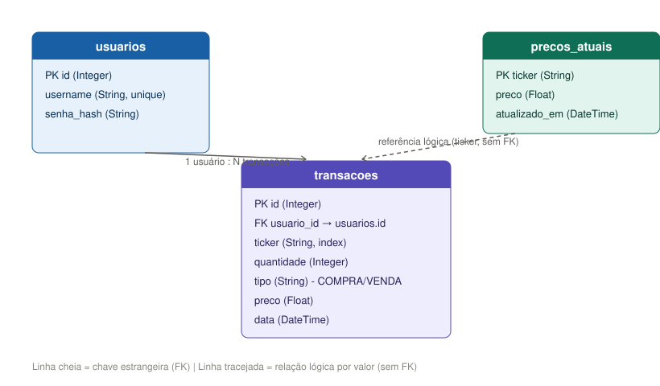

# API de Carteira de Investimentos

API REST desenvolvida em **Python** com **FastAPI**, para gerenciamento e análise de uma carteira de investimentos (ações, FIIs, etc). Projeto pessoal construído do zero com foco em aprendizado de backend e modelagem de banco de dados relacional.

> **Escopo:** este projeto é uma peça de portfólio técnico. Ele não executa ordens de compra/venda reais nem recomenda investimentos — apenas registra o histórico de transações informado pelo usuário e calcula métricas sobre ele.

## Stack

- **FastAPI** — framework web
- **SQLAlchemy** — ORM
- **Alembic** — migrations de banco de dados
- **Pydantic** — validação de dados de entrada/saída
- **JWT** — autenticação
- **SQLite** — banco de dados (ambiente de desenvolvimento)

## Modelagem do banco de dados


O schema é composto por três tabelas:

### `usuarios`
Guarda as contas cadastradas. Senha armazenada com hash (nunca em texto puro).

### `transacoes`
Cada compra ou venda de um ativo é um registro imutável nesta tabela, vinculado ao usuário dono (`usuario_id`).

**Por que transações e não um saldo fixo por ativo?**
A primeira versão do projeto guardava um saldo direto por ativo (tabela `ativos`, com `quantidade` sendo sobrescrita a cada operação). Essa abordagem foi abandonada porque:
- Perde o histórico — não dá para saber quando ou a que preço cada compra/venda aconteceu;
- Não permite calcular preço médio corretamente, já que o preço médio depende da sequência cronológica das compras;
- É mais frágil a inconsistências (updates diretos de saldo tendem a divergir da realidade com o tempo).

Guardando cada transação individualmente, a quantidade e o preço médio de cada ativo são **derivados** por cálculo a partir do histórico completo, o que é mais correto e auditável — é o mesmo princípio usado por sistemas contábeis (livro-razão) e por bancos (extratos).

### `precos_atuais`
Guarda o preço atual de cada ticker, para cálculo de patrimônio e rentabilidade.

**Por que uma tabela separada, com `ticker` como chave primária, global entre usuários?**
O preço de mercado de um ativo (ex: PETR4) é o mesmo para todos os usuários — não é um dado pessoal, é um fato do mercado. Modelar como tabela própria, com o ticker como chave primária (em vez de um `id` autoincremento), garante por construção que não existe mais de um preço "atual" cadastrado para o mesmo ticker, e evita duplicar essa informação por usuário.

Como o projeto não tem orçamento para uma API paga de cotações, o preço atual é informado manualmente via endpoint (`PUT /precos/{ticker}`), simulando o que seria uma atualização automática em um cenário de produção.



## Funcionalidades

- **Autenticação** — cadastro e login de usuários, com JWT protegendo todas as rotas de dados
- **Transações** — registro de compras e vendas de ativos
- **Consulta de ativos** — quantidade e preço médio por ativo, calculados a partir do histórico de transações
- **Preços atuais** — cadastro/atualização manual do preço de mercado de cada ticker
- **Resumo da carteira** — patrimônio total, total investido, resultado (lucro/prejuízo) e rentabilidade percentual, cruzando transações com preços atuais

## Cálculos

**Preço médio:** as transações de um ticker são processadas em ordem cronológica. A cada **compra**, o preço médio é recalculado ponderando a quantidade já existente com a nova compra. Em **vendas**, a quantidade diminui, mas o preço médio permanece o mesmo (reflete o custo do que ainda está em carteira).

**Resumo da carteira**, para cada ativo com quantidade > 0 e preço atual cadastrado:
- `patrimônio total` = Σ (quantidade × preço atual)
- `total investido` = Σ (quantidade × preço médio)
- `resultado` = patrimônio total − total investido
- `rentabilidade %` = resultado / total investido × 100

## Endpoints principais

| Método | Rota | Descrição |
|---|---|---|
| POST | `/cadastro` | Cria um novo usuário |
| POST | `/login` | Autentica e retorna o token JWT |
| POST | `/transacoes` | Registra uma compra ou venda |
| GET | `/ativos` | Lista os ativos da carteira com quantidade e preço médio |
| GET | `/ativos/{ticker}` | Detalha um ativo específico |
| PUT | `/precos/{ticker}` | Cadastra/atualiza o preço atual de um ticker |
| GET | `/precos/{ticker}` | Consulta o preço atual de um ticker |
| GET | `/carteira/resumo` | Retorna patrimônio, total investido, resultado e rentabilidade |

Todas as rotas de dados exigem autenticação (`Authorization: Bearer <token>`) e são isoladas por usuário — cada um só acessa suas próprias transações.

## Migrations

O schema é versionado com Alembic. Para aplicar as migrations em um banco novo:

```bash
alembic upgrade head
```

## Rodando o projeto

```bash
pip install -r requirements.txt
alembic upgrade head
uvicorn app.app:app --reload
```

A documentação interativa fica disponível em `/docs`.

## Decisões e próximos passos

Este projeto foi conduzido de forma incremental, com cada fase testada antes de avançar para a próxima. A versão atual (portfólio) cobre a modelagem, autenticação e as métricas essenciais de uma carteira. Uma continuidade natural — fora do escopo deste projeto — seria evoluir para um produto com integração de cotações em tempo real e frontend dedicado.
